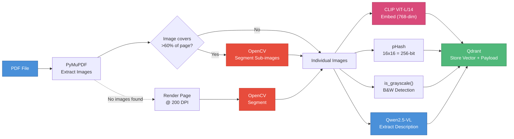
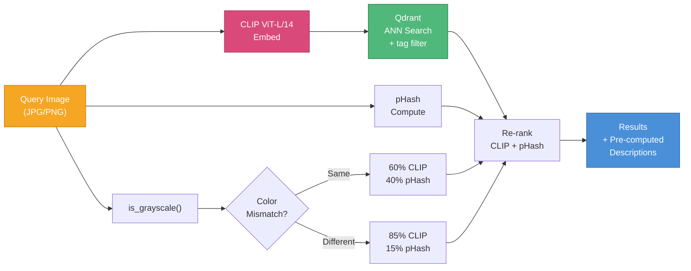
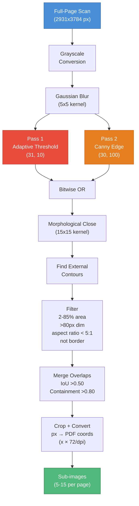
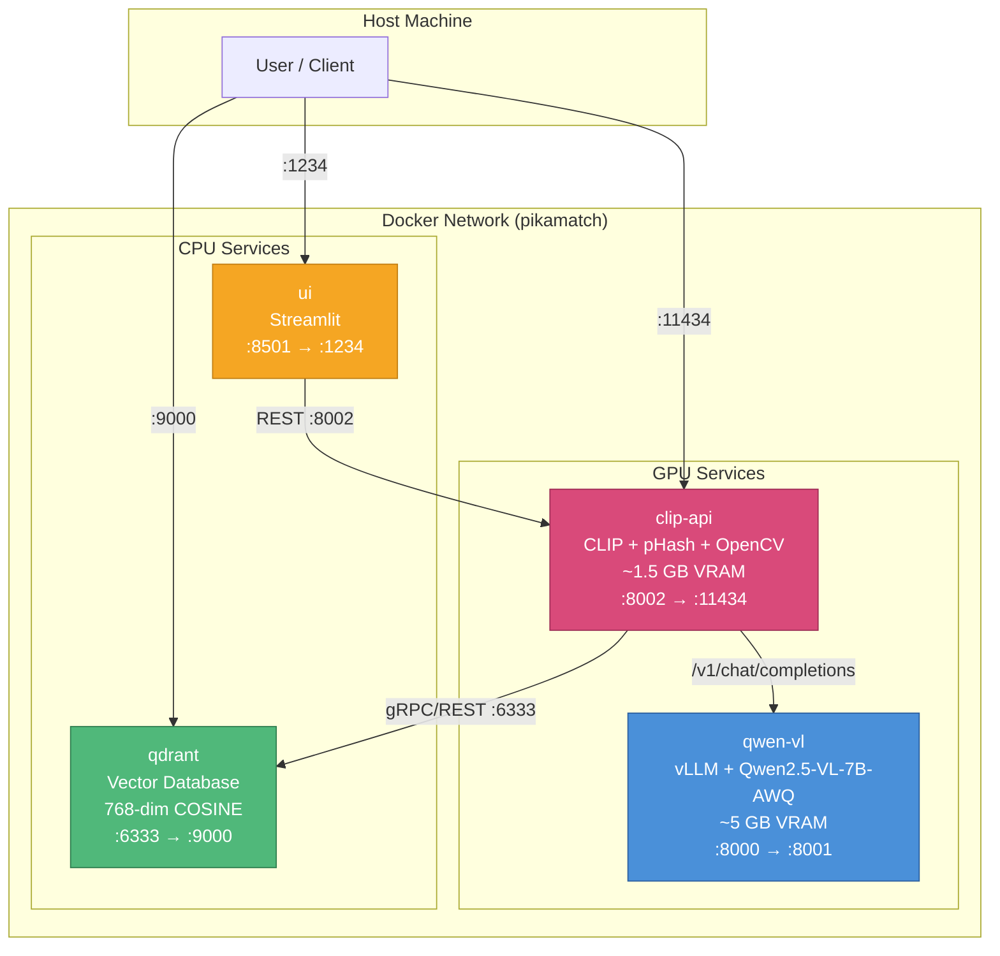

# PikaMatch

Local AI pipeline that matches images (JPG/PNG) against images inside PDF catalogues and extracts their associated descriptions. Runs 100% locally on GPU via Docker Compose.

Built around [CLIP ViT-L/14](https://github.com/openai/CLIP) for visual matching and [Qwen2.5-VL-7B](https://huggingface.co/Qwen/Qwen2.5-VL-7B-Instruct-AWQ) for structured field extraction, with a hybrid indexation + instant search architecture: PDFs are indexed once (CLIP embeddings + VLM descriptions stored in Qdrant), then searched instantly via vector similarity.

## Architecture

### Indexation Pipeline

PDFs are processed once: images are extracted (with OpenCV segmentation for full-page scans), embedded with CLIP, hashed with pHash, analyzed for grayscale, and their descriptions extracted by the VLM. Everything is stored in Qdrant for instant retrieval.



### Search Pipeline

Query images are embedded with CLIP and matched against Qdrant vectors via approximate nearest neighbor search. Results are re-ranked using a combined CLIP + pHash score with grayscale-aware weight adaptation. No VLM call needed — descriptions are pre-computed.



### Sub-Image Segmentation

When a PDF contains full-page scans (image covering >60% of page), OpenCV contour detection splits them into individual artworks. This dramatically improves CLIP scores (0.68 → 0.87+) by comparing cropped artworks instead of entire catalog pages.



## Quick Start

```bash
# Start all services
docker compose up -d --build

# Verify
curl http://localhost:11434/health
```

## Endpoints

| Service | URL | Description |
|---------|-----|-------------|
| clip-api | `http://localhost:11434` | Main API (Swagger at `/docs`) |
| qwen-vl (vLLM) | `http://localhost:8001` | Direct VLM access |
| Qdrant | `http://localhost:9000` | Vector database dashboard |
| Streamlit UI | `http://localhost:1234` | Drag-and-drop testing interface |

## Usage

### Index PDFs

```bash
# Index a directory of catalogues
python test_clip.py index /path/to/catalogues/ --batch-size 1 --tag catalogue

# Index with logging (production)
python3 -u test_clip.py index /home/ubuntu/catalogue/ --batch-size 1 --tag catalogue 2>&1 | tee indexation.log
```

PDFs are processed once: images extracted, segmented if needed, embedded, and stored with VLM-extracted descriptions. Duplicate PDFs are skipped unless `--force` is used.

### Search (Scan)

```bash
# Search across all indexed PDFs
python test_clip.py scan photo.jpg --threshold 0.0

# Filter by tag
python test_clip.py scan photo.jpg --tag catalogue
```

Instant results (~200ms) with pre-computed descriptions. No VLM call at search time.

### Direct Match (no index needed)

```bash
# Match 1 image against 1 PDF
python test_clip.py match photo.jpg catalogue.pdf

# Batch: multiple images vs 1 PDF
python test_clip.py batch catalogue.pdf img1.jpg img2.jpg img3.png
```

### Other Commands

```bash
python test_clip.py health              # Service health check
python test_clip.py extract catalogue.pdf  # Preview PDF extraction
python test_clip.py index-clear         # Clear entire index
python test_clip.py index-status        # View indexed PDFs
```

### API (cURL)

```bash
# Scan against indexed PDFs
curl -X POST http://localhost:11434/scan \
  -F "image=@photo.jpg" \
  -F "threshold=0.70" \
  -F "tag=catalogue"

# Direct match
curl -X POST http://localhost:11434/match \
  -F "jpg=@photo.jpg" \
  -F "pdf=@catalogue.pdf"
```

## Scoring

The combined score adapts weights based on color compatibility between query and indexed images:

| Condition | CLIP Weight | pHash Weight | Rationale |
|-----------|:-----------:|:------------:|-----------|
| Same colorspace (both color or both B&W) | 60% | 40% | Standard scoring |
| Color mismatch (one color, one grayscale) | 85% | 15% | pHash unreliable across colorspaces |

Grayscale detection happens automatically: at index time (stored per image in Qdrant) and at query time. The weight switch is per image pair.

| Combined Score | Verdict |
|:-:|:-:|
| > 0.95 | identical |
| > 0.90 | very_similar |
| > 0.80 | similar |
| > 0.70 | related |
| < 0.70 | different |

## Docker Compose Services



| Service | Image | Internal | Host | GPU |
|---------|-------|:--------:|:----:|:---:|
| `qwen-vl` | `vllm/vllm-openai:latest` | 8000 | **8001** | ~5 GB |
| `qdrant` | `qdrant/qdrant:latest` | 6333 | **9000** | - |
| `clip-api` | custom (nvidia/cuda) | 8002 | **11434** | ~1.5 GB |
| `ui` | custom (python:3.11-slim) | 8501 | **1234** | - |

**Dependency chain:** `qwen-vl` + `qdrant` → `clip-api` → `ui`

**Total VRAM:** ~6.5 GB (comfortable on RTX 5080 16 GB)

## Tech Stack

| Component | Technology | Purpose |
|-----------|-----------|---------|
| Visual matching | CLIP ViT-L/14 (OpenAI) | Semantic image embeddings + cosine similarity |
| Resize robustness | imagehash (pHash) | Perceptual hashing — robust to resize/compression |
| PDF extraction | PyMuPDF (fitz) | Extract embedded images + their bounding boxes |
| Segmentation | OpenCV (contour detection) | Split full-page scans into individual artworks |
| Vector DB | Qdrant | Store embeddings + payloads, ANN search |
| Description reading | Qwen2.5-VL-7B-Instruct-AWQ via vLLM | Vision LLM reads PDF page zones to extract fields |
| API | FastAPI | REST API for matching, extraction, batch |
| UI | Streamlit | Drag-and-drop testing interface |
| Serving | Docker Compose with NVIDIA runtime | Everything containerized |

## Project Structure

```
pikamatch/
├── docker-compose.yml          # Service orchestration (4 services)
├── .env                        # HF_TOKEN (gitignored)
├── Dockerfile.api              # CLIP + pHash + OpenCV + FastAPI
├── Dockerfile.ui               # Streamlit
├── api.py                      # Main API — matching, indexing, segmentation, VLM
├── ui.py                       # Streamlit UI (3 tabs)
├── test_clip.py                # CLI tool
└── docs/
    ├── architecture.mmd        # Docker services (Mermaid source)
    ├── indexation-flow.mmd     # Indexation pipeline
    ├── search-flow.mmd         # Search pipeline
    └── segmentation-flow.mmd   # OpenCV segmentation algorithm
```

## Hardware Requirements

**Minimum (dev/POC):**
- NVIDIA GPU with 16 GB VRAM (RTX 5080 / RTX 4090)
- 32 GB RAM
- ~15 GB storage for models (cached after first download)

**Production:**
- AWS EC2 g6e.xlarge (NVIDIA L40S 48 GB)
- Scales to larger catalogue volumes
